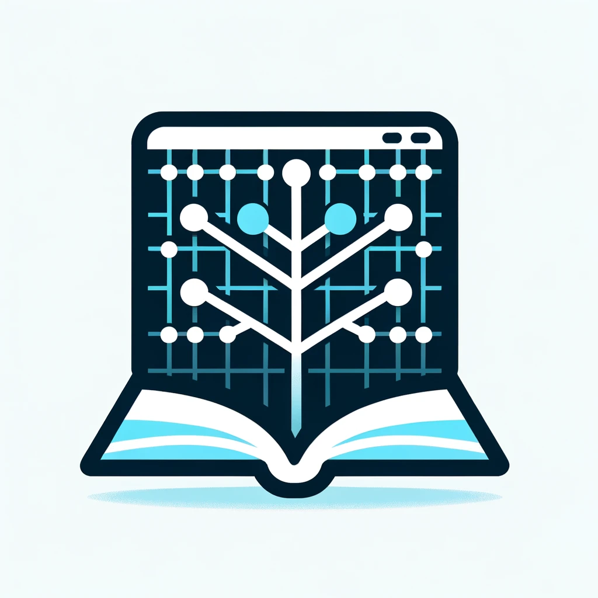

Xandikos is a lightweight yet complete CardDAV/CalDAV server that backs onto a Git repository.

Xandikos (Ξανδικός or Ξανθικός) takes its name from the name of the March month
in the ancient Macedonian calendar, used in Macedon in the first millennium BC.

Extended documentation can be found `on the home page <https://www.xandikos.org/docs/>`_.

Implemented standards
=====================

The following standards are implemented:

- :RFC:`4918`/:RFC:`2518` (Core WebDAV) - *implemented, except for LOCK operations (COPY/MOVE implemented for non-collections)*
- :RFC:`4791` (CalDAV) - *fully implemented*
- :RFC:`6352` (CardDAV) - *fully implemented*
- :RFC:`5397` (Current Principal) - *fully implemented*
- :RFC:`3253` (Versioning Extensions) - *partially implemented, only the REPORT method and {DAV:}expand-property property*
- :RFC:`3744` (Access Control) - *partially implemented*
- :RFC:`5995` (POST to create members) - *fully implemented*
- :RFC:`5689` (Extended MKCOL) - *fully implemented*
- :RFC:`6578` (Collection Synchronization for WebDAV) - *fully implemented*
- :RFC:`7953` (Calendar Availability) - *fully implemented*

The following standards are not implemented:

- :RFC:`6638` (CalDAV Scheduling Extensions) - *not implemented*
- :RFC:`7809` (CalDAV Time Zone Extensions) - *not implemented*
- :RFC:`7529` (WebDAV Quota) - *not implemented*
- :RFC:`4709` (WebDAV Mount) - `intentionally <https://github.com/jelmer/xandikos/issues/48>`_ *not implemented*
- :RFC:`5546` (iCal iTIP) - *not implemented*
- :RFC:`4324` (iCAL CAP) - *not implemented*

See `DAV compliance <notes/dav-compliance.rst>`_ for more detail on specification compliance.

Limitations
-----------

- No multi-user support

Supported clients
=================

Xandikos has been tested and works with the following CalDAV/CardDAV clients:

- `Vdirsyncer <https://github.com/pimutils/vdirsyncer>`_
- `caldavzap <https://www.inf-it.com/open-source/clients/caldavzap/>`_/`carddavmate <https://www.inf-it.com/open-source/clients/carddavmate/>`_
- `evolution <https://gitlab.gnome.org/GNOME/evolution/-/wikis/home>`_
- `DAVx5 <https://www.davx5.com/>`_ (formerly DAVDroid)
- `sogo connector for Icedove/Thunderbird <https://www.sogo.nu/download.html#/frontends>`_
- aCALdav syncer for Android
- `pycardsyncer <https://github.com/geier/pycarddav>`_
- `akonadi <https://community.kde.org/KDE_PIM/Akonadi>`_
- `CalDAV-Sync <https://dmfs.org/caldav/>`_
- `CardDAV-Sync <https://dmfs.org/carddav/>`_
- `Calendarsync <https://play.google.com/store/apps/details?id=com.icalparse>`_
- `Tasks <https://tasks.org/>`_
- `AgendaV <https://github.com/agendav/agendav>`_
- `CardBook <https://gitlab.com/cardbook/cardbook/>`_
- Apple's iOS
- `homeassistant's CalDAV integration <https://www.home-assistant.io/integrations/caldav/>`_
- `pimsync <https://pimsync.whynothugo.nl/>`_
- `davcli <https://git.sr.ht/~whynothugo/davcli>`_
- `Thunderbird <https://www.thunderbird.net/>`_

Dependencies
============

At the moment, Xandikos supports Python 3 (see pyproject.toml for specific version)
as well as Pypy 3. It also uses `Dulwich <https://github.com/dulwich/dulwich>`_,
`Jinja2 <http://jinja.pocoo.org/>`_,
`icalendar <https://github.com/collective/icalendar>`_, and
`defusedxml <https://github.com/tiran/defusedxml>`_.

E.g. to install those dependencies on Debian:

.. code:: shell

  sudo apt install python3-dulwich python3-defusedxml python3-icalendar python3-jinja2

Or to install them using pip:

.. code:: shell

  python setup.py develop

Container
---------

A Containerfile is also provided; see the comments on the top of the file for
configuration instructions. The container image is regularly built and
published at ``ghcr.io/jelmer/xandikos``. For each release,
a ``v$RELEASE`` tag is available - e.g. ``v0.2.11`` for release *0.2.11*.
For a full list, see `the Container overview page
<https://github.com/jelmer/xandikos/pkgs/container/xandikos>`_.

The container image can be configured using environment variables:

- ``PORT`` - Port to listen on (default: 8000)
- ``METRICS_PORT`` - Port for metrics endpoint (default: 8001)
- ``LISTEN_ADDRESS`` - Address to bind to (default: 0.0.0.0)
- ``DATA_DIR`` - Data directory path (default: /data)
- ``CURRENT_USER_PRINCIPAL`` - User principal path (default: /user/)
- ``ROUTE_PREFIX`` - URL route prefix (default: /)
- ``AUTOCREATE`` - Auto-create directories (true/false)
- ``DEFAULTS`` - Create default calendar/addressbook (true/false)
- ``DEBUG`` - Enable debug logging (true/false)
- ``DUMP_DAV_XML`` - Print DAV XML requests/responses (true/false)
- ``NO_STRICT`` - Enable client compatibility workarounds (true/false)

See ``examples/docker-compose.yml`` and the
`man page <https://www.xandikos.org/manpage.html>`_ for more info.

Running
=======

Xandikos can either directly listen on a plain HTTP socket, or it can sit
behind a reverse HTTP proxy.

Testing
-------

To run a standalone (no authentication) instance of Xandikos,
with a pre-created calendar and addressbook (storing data in *$HOME/dav*):

.. code:: shell

  ./bin/xandikos --defaults -d $HOME/dav

A server should now be listening on `localhost:8080 <http://localhost:8080/>`_.

Note that Xandikos does not create any collections unless --defaults is
specified. You can also either create collections from your CalDAV/CardDAV client,
or by creating git repositories under the *contacts* or *calendars* directories
it has created.

Production
----------

The easiest way to run Xandikos in production is by running a reverse HTTP proxy
like Apache or nginx in front of it.
The xandikos script can either listen on the local host on a particular port, or
it can listen on a unix domain socket.

For example init system configurations, see examples/.

Client instructions
===================

Some clients can automatically discover the calendars and addressbook URLs from
a DAV server (if they support RFC:`5397`). For such clients you can simply
provide the base URL to Xandikos during setup.

Clients that lack such automated discovery require the direct URL to a calendar
or addressbook. In this case you should provide the full URL to the calendar or
addressbook; if you initialized Xandikos using the ``--defaults`` argument
mentioned in the previous section, these URLs will look something like this::

  http://dav.example.com/user/calendars/calendar

  http://dav.example.com/user/contacts/addressbook

Contributing
============

Contributions to Xandikos are very welcome. If you run into bugs or have
feature requests, please file issues `on GitHub
<https://github.com/jelmer/xandikos/issues/new>`_. If you're interested in
contributing code or documentation, please read `CONTRIBUTING
<CONTRIBUTING.md>`_. Issues that are good for new contributors are tagged
`new-contributor <https://github.com/jelmer/xandikos/labels/new-contributor>`_
on GitHub.

Help
====

There is a *#xandikos* IRC channel on the `OFTC <https://www.oftc.net/>`_
IRC network, and a `Xandikos <https://groups.google.com/forum/#!forum/xandikos>`_
mailing list.
