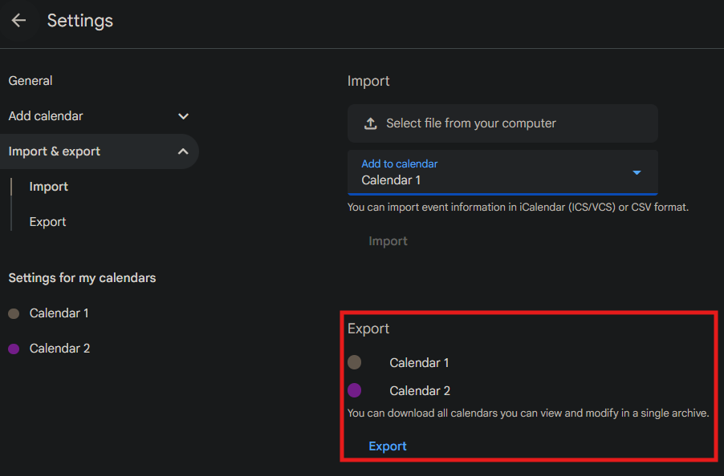

Importing Calendars
===================

Xandikos uses `git` to manage your underlying calendars. This guide shows how to import pre-existing events, such as from popular calendar services as Google Calendar.

Background Requirements
-----------------------
This guide assumes the following:
* Basic experience with `git`
* A working instance of Xandikos
* A calendar client connected to your Xandikos instance

Exporting Your Existing Calendar
--------------------------------
Firstly, you will need to export your calendar events from your existing calendar service in the standard `.ics` format. The Internet Calendaring and Scheduling Core Object Specification (iCalendar) standard  is defined in RFC 5545, and is the underlying format used by Xandikos. Most calendar services, including Xandikos, have the ability to export existing calendars as standard iCalendar `.ics` files.

Search for the option to export your existing calendar, and save the resultant `.ics` file somewhere on your computer.

A Word on `.ics` files
~~~~~~~~~~~~~~~~~~~~~~
The default behavior of Xandikos is to store each event in a separate `.ics` file. Most calendar services will export your existing calendar as a single `.ics` file with all your events. This singular file can be imported into Xandikos, so long as it contains a SINGLE calendar. You should export your existing calendars each as a separate `.ics` file, but each file can contain your entire calendar with multiple events.

Creating Your Target Calendar
-----------------------------
You can choose to import your calendar to a new calendar or an existing one. If you would like to import into a brand new calendar, use your existing connected client to create a new calendar. This should generate a new folder within your Xandikos `data` directory, usually as `data/user/calendars/<new UID>`.

If you would like to import to an existing calendar, navigate to your Xandikos `data` directory to locate your existing calendar's folder. As a hint, if you see a bunch of folders with random unique IDs in your `/data/user/calendars` folder, your calendar's name may be stored within each folder's `.xandikos` file as `displayname`, for example:

.. code-block:: ini

    [DEFAULT]
    type = calendar
    displayname = My Calendar
    color = #FFFFFF

Import Your `.ics` File
-----------------------
After you have identified which folder pertains to your target calendar, copy your exported `.ics` iCalendar file into that folder:

.. code-block:: shell

    cp myCalendar.ics data/user/calendars/<Your Calendar ID>

Once the file is copied, use `git` to add the iCalendar file and commit it to that Calendar's git repository:

.. code-block:: shell

    cd data/user/calendars<Your Calendar ID>
    git add myCalendar.ics
    git commit -m "Importing my old calendar"

The changes will only be recognized by Xandikos once the changes are fully committed by `git`. Afterwards that should be it! Refresh your calendar client, and your new events should now be visible within your connected clients. Depending on the number of events you have, the sync may take a while.

A Word on File Structure
~~~~~~~~~~~~~~~~~~~~~~~~
While you have imported your pre-existing events as a singular iCalendar `.ics` file, new, subsequent events you add will still be created as separate `.ics` files; Xandikos will not automatically append them to your existing `.ics` file. If you want to merge all your events again, you will need to use Xandikos to export a backup of your calendar.
